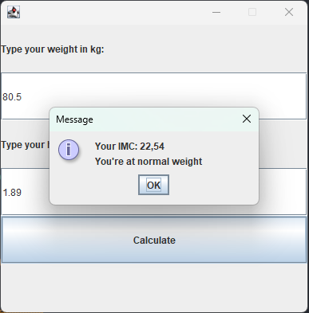
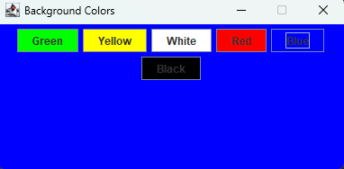
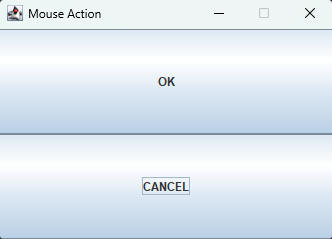
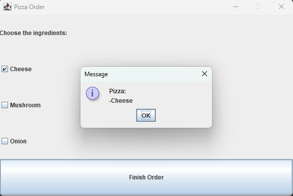
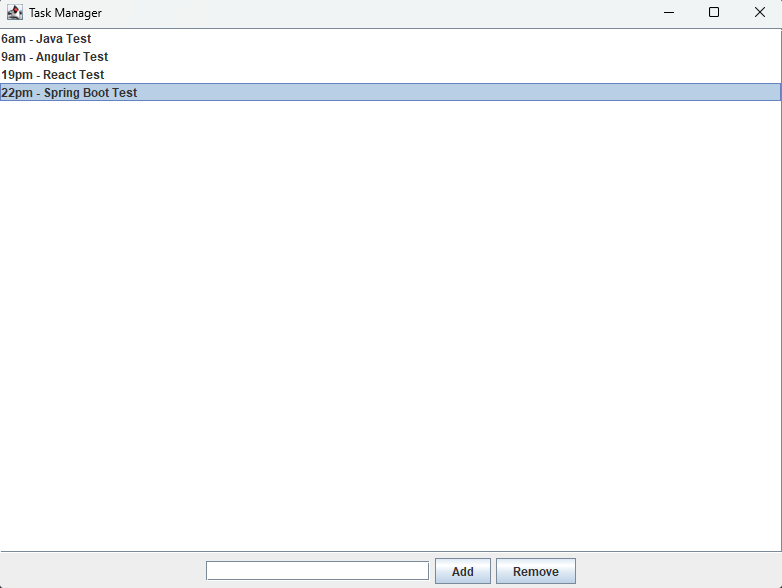

  <h2>Interfaces gráficas em Java</h2>
  

    Desenvolvi alguns exercícios acadêmicos focados em interfaces gráficas em Java. Foi um projeto crucial para
    aprimorar meu conhecimento na linguagem e evoluir no desenvolvimento Full Stack. Essa experiência me
    permitiu entender melhor a criação de interfaces interativas e consolidar conceitos importantes no
    desenvolvimento de aplicações completas.
  

  <h1>Propostos<h1>
    <h3>Calculator<h3>
      
    <h3>IMC<h3>
      
    <h3>Login</h3>
      
    <h3>Market</h3>
      
    <h3>Window 1</h3>
      
    <h3>Window 2</h3>
      
    <h3>Mouse Action</h3>
      
    <h3>Mouse Action 2</h3>
      
    <h3>Pizza Order</h3>
      
    <h3>Task Manager</h3>
      

